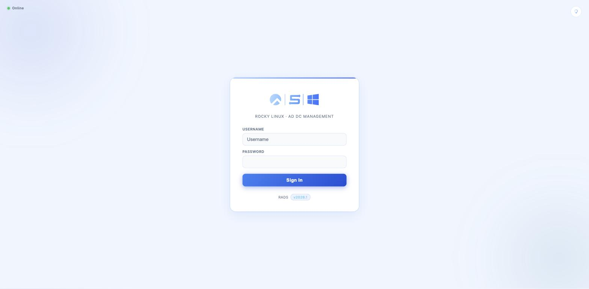
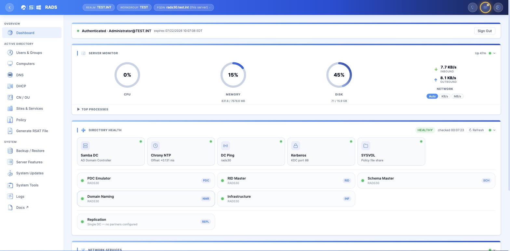
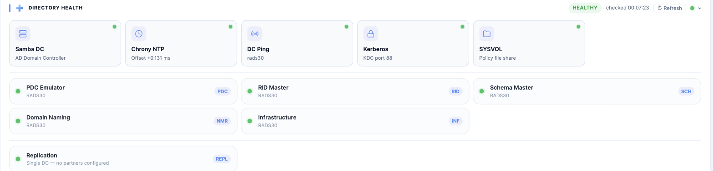

# RADS-WEB

**Rocky Active Directory Server — Web Edition**

RADS-WEB turns a bare Rocky Linux 10 box into a fully working Samba Active Directory domain controller with a
modern web dashboard on top — no Windows Server, no RSAT, no separate management console. Provisioning,
day-to-day AD administration, DNS, DHCP, replication, Group Policy, backups, and system health all live in one
browser-based UI, secured behind the same login your Rocky server already uses.

📖 **Full documentation:** https://fumatchu.github.io/RADS_WEB/

---

## Screenshots

| Login | Dashboard |
|---|---|
|  |  |

**Directory Health**



---

## What It Does

RADS-WEB is a Samba4 AD DC (built from SRPM, since Rocky's stock packaging doesn't ship the AD DC role) paired
with a FastAPI backend and a single-page dashboard. Once installed, everything below is managed from the web UI
— no `samba-tool` command line required for routine work, though a full root terminal is still available in
the browser when you need it.

### Dashboard & Health

- **Directory Health** — live status for the local Samba DC, Chrony NTP offset, DC Ping (CLDAP), Kerberos (port
  88), and SYSVOL, plus a card for every *other* known DC in the forest with its own Ping/Kerberos reachability
  and replication status, pulled straight from AD's Sites topology — no manual peer list to maintain.
- **System Monitor** — CPU, memory, disk, and network usage with drill-down detail, service status for every
  managed daemon, and a badge that escalates red the moment anything — local or a peer DC — needs attention.
- **Server Switcher** — jump between known domain controllers' dashboards directly from the header.
- **Web Terminal** — a full root PTY shell over WebSocket, for anything the UI doesn't (yet) cover.

### Active Directory

- Users, groups, and computer object management
- OU / container browsing and management
- FSMO role viewing, transfer, and seizure (including a guided path for recovering a role from an offline DC)

### DNS

- Manages Samba's AD-integrated DNS server (zones replicate via DRS along with the rest of the directory)
- Create/view/delete forward and reverse zones and records, validate zones, search across records
- **Hybrid DNS** — optionally layer a standalone BIND-managed zone alongside Samba's internal DNS

### DHCP

- Manages **Kea DHCP4** — scope and option configuration, real-time lease viewing, filter by subnet
- Two-way navigation between a DHCP scope and its paired DNS zone when dynamic DNS is in use

### Sites & Services

- Sites & Subnets, Site Links, and Domain Controller placement
- Live replication topology diagram with per-partner status and a **Force Replication** button (with pass/fail
  per naming context)
- FSMO role management

### Policy

- Group Policy Objects — create, edit, and manage OU/domain/site links, all from the browser
- SYSVOL browsing
- Password Policy and fine-grained Password Settings Objects (PSOs)

### System Administration

- **Backup / Restore** — back up the Samba AD database and RADS-WEB's own configuration, restore from a known
  point
- **System Updates** — OS package updates (via `dnf`), Samba updates (tracked and rebuilt independently, since
  Samba is SRPM-built rather than a stock package), and RADS-WEB platform updates, each on its own update path
- **Server Features** — enable optional roles (e.g. turning on DHCP) after initial install
- **RSAT file generation**, log viewing/download, and general system tools (services, network config, user
  management, reboot/shutdown)

### Security

- Login is PAM-backed against real Rocky Linux system accounts; the console login banner is customized during
  install to point administrators at the web GUI and identify the server's role
- Fail2Ban and firewalld are configured automatically
- HTTPS-only by default (self-signed certificate generated on install)

---

## Requirements

- **OS:** Rocky Linux 10.0+ (the installer checks and refuses to continue on anything older)
- **Access:** Root, and working internet connectivity during install (EPEL/CRB/Devel repos are enabled, a full
  `dnf upgrade` runs, and the RADS-WEB application is pulled from this repository)
- **Network:** A static IP is strongly recommended (the installer will offer to configure one if the interface
  is on DHCP), and a resolvable hostname/FQDN
- **Hardware:** Modest — comparable to any small-office domain controller. Both physical and virtual machines
  are supported; VM guest tools are detected and installed automatically

Have ready before you start:

| Install type | You'll need |
|---|---|
| First Domain Controller | The AD realm/domain name to provision, and an Administrator password (min. 8 characters) |
| Join Existing AD Forest | The FQDN of an existing, reachable domain controller, and that domain's Administrator password |

---

## Installation

As root, on the server you're installing:

```bash
curl -fsSL https://raw.githubusercontent.com/fumatchu/RADS_WEB/main/RADS_WEB-Installer.sh | bash
```

This bootstrap script:

1. Confirms you're running as root, on Rocky Linux 10.0+
2. Installs a handful of small dependencies (`wget`, `git`, `ipcalc`, `dialog`)
3. Clones this repository
4. Launches the main installer, which asks which kind of install this is:

```text
Select Installation Type

1) Install First Domain Controller (new AD forest)
2) Join Existing AD Forest (additional Domain Controller)
```

- **Install First Domain Controller** — provisions a brand-new AD forest on this server. Use this for the very
  first RADS-WEB server in your environment.
- **Join Existing AD Forest** — adds this server as an additional domain controller in a forest that already
  exists.

**Recommended:** start from a clean, minimal Rocky Linux install, assign a static IP before or during setup,
and let the installer manage its own dependencies rather than pre-installing packages yourself.

### After Install

Once the installer finishes, RADS-WEB is reachable over HTTPS at the server's hostname (your browser will warn
once about the self-signed certificate — that's expected). Sign in with the domain `Administrator` account to
authenticate against Active Directory and unlock the dashboard.

---

## Documentation

Full docs — install guide, and a page-by-page walkthrough of every feature above — are published at:

**https://fumatchu.github.io/RADS_WEB/**

A link to the same docs is also available from the sidebar of the dashboard itself once installed.
